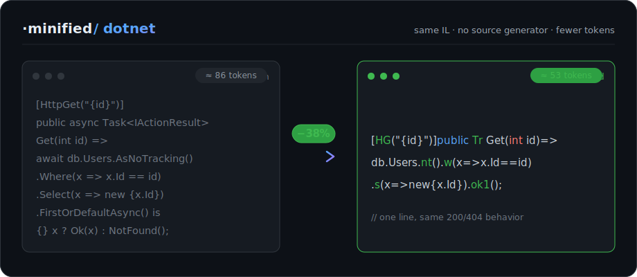

<div align="center"><pre>
███╗   ███╗██╗███╗   ██╗██╗███████╗██╗███████╗██████╗ 
████╗ ████║██║████╗  ██║██║██╔════╝██║██╔════╝██╔══██╗
██╔████╔██║██║██╔██╗ ██║██║█████╗  ██║█████╗  ██║  ██║
██║╚██╔╝██║██║██║╚██╗██║██║██╔══╝  ██║██╔══╝  ██║  ██║
██║ ╚═╝ ██║██║██║ ╚████║██║██║     ██║███████╗██████╔╝
╚═╝     ╚═╝╚═╝╚═╝  ╚═══╝╚═╝╚═╝     ╚═╝╚══════╝╚═════╝ 
              same .NET code · fewer tokens · no magic
</pre></div>

<p align="center"><strong>Your AI pays by the token. ASP.NET Core makes it pay a lot. Smoower.Minified makes it pay less.</strong></p>

<p align="center">part of the <code>·minified</code> family — <strong>dotnet</strong> today, react / vue / tooling next</p>

<p align="center">
  <a href="https://github.com/smoower/dotnet-minified/actions/workflows/ci.yml"></a>
  <a href="https://www.nuget.org/packages/Smoower.Minified.AspNetCore"></a>
  <a href="https://dotnet.microsoft.com"></a>
  <a href="LICENSE"></a>
</p>

<p align="center">
  <a href="https://smoower.github.io/dotnet-minified/">Docs</a> ·
  <a href="https://smoower.github.io/dotnet-minified/quickstart.html">Quickstart</a> ·
  <a href="https://smoower.github.io/dotnet-minified/compaction-levels.html">Compaction levels</a> ·
  <a href="https://smoower.github.io/dotnet-minified/cheat-sheet.html">Cheat sheet</a> ·
  <a href="https://smoower.github.io/dotnet-minified/economics.html">Does it pay off?</a>
</p>

<div align="center">
  
</div>

---

Smoower.Minified is a set of small C# libraries that strip the boilerplate out of .NET APIs (controllers, EF Core queries, DI, logging) and replace it with short, stable forms your AI can type in far fewer tokens.

It's plain C#. Same IL, no transpiler, no magic. The code just gets shorter.

Across a project that's roughly **10-25% fewer output tokens**, and **25-45%** on the controller files an assistant rewrites most. Fewer tokens means faster generation, a smaller bill, and more room in the context window. Nothing about runtime behavior changes.

The saving also compounds. An agent doesn't write a file once, it reads and rewrites it on every step of the loop, and each smaller step feeds the next.

Full docs, the per-mapping cheat sheet, and the economics: **<https://smoower.github.io/dotnet-minified/>**

## Get started

```bash
# 1 — add the packages (ASP.NET Core backend set)
dotnet add package Smoower.Minified.AspNetCore
dotnet add package Smoower.Minified.EFCore

# 2 — drop the usings + aliases into a GlobalUsings.cs
#     (copy from samples/Smoower.Minified.SampleApi/GlobalUsings.cs)

# 3 — point your AI at the style
#     Claude Code → just ask it to "use Smoower.Minified"  (ships as a skill)
#     Copilot / Cursor / GPT → paste prompts/system-prompt.md
```

Your next controller comes out compact. The [Quickstart](https://smoower.github.io/dotnet-minified/quickstart.html) and [Installation](https://smoower.github.io/dotnet-minified/installation.html) guides cover the AI-wired and by-hand paths.

### Use it in Claude Code

Smoower.Minified ships as a Claude Code plugin. Install it from Anthropic's community marketplace and the skill applies the compact style automatically — it asks which compaction level to use first:

```
/plugin marketplace add anthropics/claude-plugins-community
/plugin install smoower-minified@claude-community
```

It auto-invokes on any project that references the `Smoower.Minified.*` packages, or call it explicitly with `/smoower-minified:dotnet`.

## What it looks like

Same action, hand-written and with Smoower.Minified. Identical behavior, identical compiled IL.

```csharp
[HttpGet("{id}")]
public async Task<IActionResult> Get(int id)
{
    var x = await _db.Users
        .AsNoTracking()
        .Where(u => u.Id == id)
        .Select(u => new { u.Id, u.Name, u.Email })
        .FirstOrDefaultAsync();
    return x == null ? NotFound() : Ok(x);
}
```

```csharp
[HG("{id}")]public Tr Get(int id)=>db.Users.nt().w(x=>x.Id==id).s(x=>new{x.Id,x.Name,x.Email}).ok1();
```

`ok1()` runs the query and returns `200` with the row, or `404` if it's missing. The [Cheat sheet](https://smoower.github.io/dotnet-minified/cheat-sheet.html) lists every mapping.

## Compaction levels

It's a dial, not a switch. Pick how much you trade readable-on-disk for raw token count. The Claude Code skill asks which level before it generates.

| Level | What it adds | Readable on disk? |
| --- | --- | --- |
| **L1 — Aliases** | smoower short handles + optional `[Crud<>]` generator | yes |
| **L2 — Mapped** | short domain names, long form pinned in `[JPN]`/`[Col]`/`global using` + a `names.map` | with tooling |
| **L3 — Max** | whitespace packed, every newline and indent removed | tooling view |

On a real task-management API ([`samples/TodoApi`](samples/TodoApi)) the ladder went **5049 → 4121 (~18%) → 3785 (~25%)** Claude tokens. The contract (routes, status codes, JSON/DB values) stays fixed at every level. More on [Compaction levels](https://smoower.github.io/dotnet-minified/compaction-levels.html).

## Packages

Take only what you use. Data and web layers are split, so a console worker can reference `EFCore` without pulling in ASP.NET Core.

| Package | What |
| --- | --- |
| `Smoower.Minified.Core` | guards (`nil`/`emp`/`none`) and base aliases, zero framework deps |
| `Smoower.Minified.AspNetCore` | attributes, MVC aliases, result-fusing terminators |
| `Smoower.Minified.MinimalApi` | verb mappers (`g`/`po`/`pu`/`pa`/`dl`/`grp`), `auth`/`anon`, `IResult` terminators |
| `Smoower.Minified.EFCore` | query + write helpers (async default, `S`-suffixed sync) |
| `Smoower.Minified.Http` | `HttpClient` JSON helpers |
| `Smoower.Minified.Redis` | StackExchange.Redis helpers |
| `Smoower.Minified.Logging` | `ILogger` helpers |
| `Smoower.Minified.Hosting` | DI registration helpers |
| `Smoower.Minified.Validation` | `MiniValidator<T>` over FluentValidation |
| `Smoower.Minified.Json` | `toJson`/`fromJson<T>` (System.Text.Json or Newtonsoft) |
| `Smoower.Minified.Dapper` | `q`/`q1`/`ex`/`scalar` over `IDbConnection` |
| `Smoower.Minified.Testing` | fluent xUnit assertions (`eq`/`notNul`/`isType`/`throws`) + `[F]`/`[Th]`/`[In]` aliases |
| `Smoower.Minified.Identity` | short `UserManager`/`SignInManager`/`RoleManager` ops |
| `Smoower.Minified.Generators` | opt-in `[Crud<>]` source generator *(preview, not yet on NuGet)* |

Full breakdown on [Libraries](https://smoower.github.io/dotnet-minified/libraries.html).

## The one rule: don't compact the contract

This changes how the code is written, never what it does. Route templates, HTTP verbs, status codes, and DTO/JSON names stay exactly as your API requires. Shorten the code, not the contract.

## The minified family

`dotnet-minified` is the first of a family. Anywhere an AI pays by the token to re-emit framework ceremony, a stable compact dialect that keeps the contract pays for itself.

- **`dotnet-minified`** — ASP.NET Core / EF Core. Shipping today. *(this repo)*
- **`react-minified`, `vue-minified`, …** — same idea for front-end ceremony. On the roadmap.
- **Tooling** — a CLI and VS Code integration to apply, lint, and round-trip the compact style. Planned on top of the open libraries.

The libraries stay source-available and free. Want a runtime covered, or building one? Open an issue.
